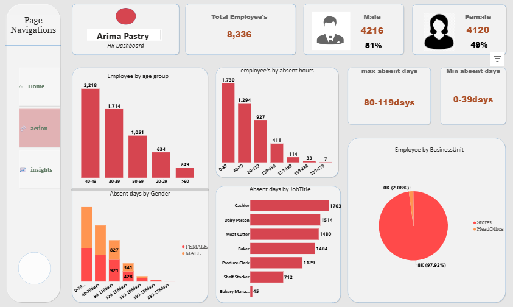
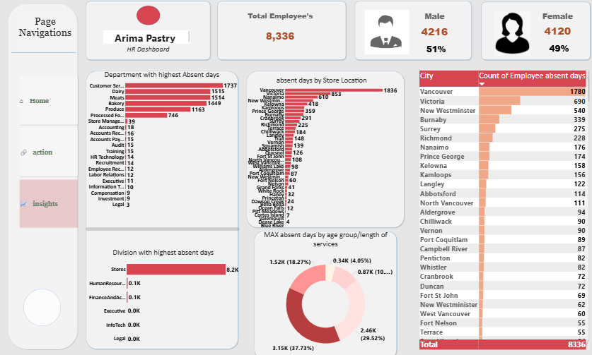
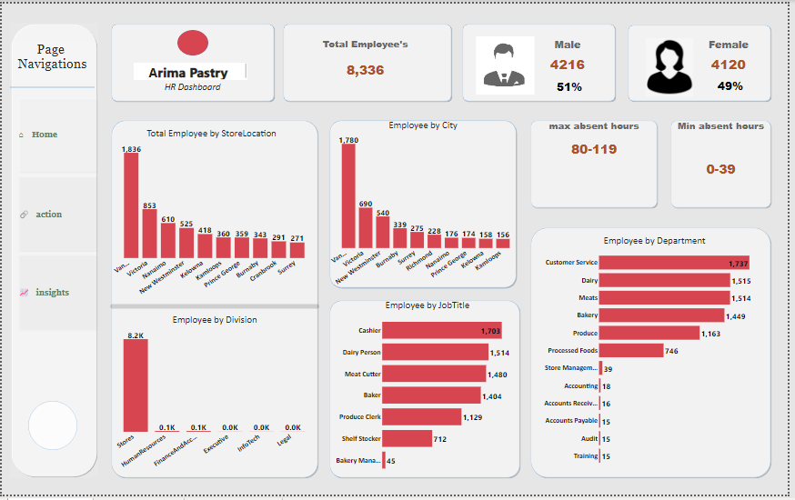

# Arima Pastry: Workforce & Absenteeism Analytics

A Power BI HR dashboard analyzing workforce demographics and absenteeism patterns across roles, age groups, locations, and business units for Arima Pastry.

[View live Power BI dashboard](https://app.powerbi.com/view?r=eyJrIjoiMzA5NTFjOTctNjBhZS00Y2ZlLWIwNDMtNzhmZDY1OTVmNzNhIiwidCI6IjdiYWEzZDBkLTdmZjYtNDFkNS05NmQ3LTg0NzM3NzY0NjAyMSJ9) | [View portfolio](https://yusuf-data-analytics-portfolio.netlify.app/)

**Note on data:** this is a portfolio/practice analysis referencing an Arima Pastry-branded HR dataset. It is not presented as, and there is no evidence of, a real client engagement.

## Project overview

This dashboard analyzes workforce demographics and absenteeism across 8,336 employees, breaking down headcount by gender, age band, and business unit (Stores vs. Head Office), and absenteeism by role, department, store location/city, and absence-hour band.

This project is relevant to anyone evaluating whether I can work outside a sales/marketing context and apply the same segmentation discipline to a people-analytics problem: identifying which roles, locations, and groups carry a disproportionate share of absence.

## Business questions

- How is the workforce distributed across business units, age groups, and gender?
- Which job roles and departments account for the most absenteeism?
- Which store locations/cities carry the most absence?
- How are absence hours distributed across the workforce?
- Does absenteeism differ by gender?

## Key KPIs

| KPI | What it measures | Why it matters |
|---|---|---|
| Total headcount | Total number of employees (8,336) | Baseline workforce size |
| Gender split | Male vs. female employee count (4,216 / 4,120) | Confirms whether workforce composition is balanced |
| Age band distribution | Headcount grouped into age brackets | Identifies the dominant age segment for workforce planning |
| Business unit split (Stores vs. Head Office) | Share of employees by business unit | Shows where the workforce, and therefore absence risk, is concentrated |
| Total absent days by role | Cumulative absence days per job role | Flags which roles carry the most absenteeism |
| Total absent days by department | Cumulative absence days per department | Flags which functional areas carry the most absenteeism |
| Total absent days by city/store location | Cumulative absence days per location | Flags which physical locations carry the most absenteeism |
| Employee count by absence-hour band | Number of employees in each absence-hours range | Shows how absence is distributed across the workforce, not just the average |
| Absence entries by gender (per absence-day band) | Count of absence entries split by gender within a given range | Tests whether absence patterns differ meaningfully by gender |

## Key findings

- Total headcount is **8,336 employees**: **4,216 male (51%)** and **4,120 female (49%)**. The **40–49** age bracket is the largest segment (**2,218 employees**), followed by **30–39** (**1,714 employees**).
- The workforce is heavily concentrated in Stores: **97.92% (8,163 employees)** work in Stores versus **2.08%** at Head Office — meaning almost all absenteeism risk sits in front-line store roles rather than head-office functions. Separately, when absence itself (not headcount) is broken down by division, Stores accounts for roughly **8,200 of total absent days**, dwarfing Human Resources, Finance & Accounting, Executive, InfoTech, and Legal combined.
- Absenteeism is concentrated in a handful of front-line roles: Cashiers log the most total absent days (**1,703**), followed by Dairy Persons (**1,514**), Meat Cutters (**1,480**), and Bakers (**1,404**). Bakery Managers, by contrast, record the fewest (**45**) — a roughly 38x gap between the highest and lowest role. At the department level, Customer Service (**1,737**), Dairy (**1,515**), Meats (**1,514**), and Bakery (**1,449**) carry the most absent days.
- Absence is heavily concentrated geographically: Vancouver leads all locations by a wide margin, recording **1,780 absent days** in the city breakdown and **1,836** in the store-location breakdown, more than double the next-highest location, Victoria (**690 / 853**).
- Most absence sits in the lower range: **1,730 employees** fall in the **0–39 hour** absence band, with employee counts dropping sharply as absence hours increase, suggesting a small subset of employees may account for a disproportionate share of high-hour absence.
- In the **80–119 day** absence range, female employees recorded more entries (**921**) than male employees (**827**), a modest but notable difference worth investigating further rather than treating as conclusive on its own.

## Business recommendations

These are reasonable actions the findings could support; they have not been implemented and no real-world business outcome is claimed:

- **Prioritize absence management in the four highest-absence roles** (Cashier, Dairy Person, Meat Cutter, Baker) **and the Vancouver location specifically.** Since these roles and this single location account for a disproportionate share of total absent days, targeted scheduling, staffing buffers, or root-cause review here would likely have the largest impact on overall absenteeism.
- **Investigate why Vancouver's absence total is more than double the next-highest location.** The scale of the gap (roughly 2.1x Victoria) suggests something location-specific — staffing levels, local management practice, or workforce size — rather than a company-wide pattern.
- **Investigate the small high-absence-hours segment separately from the broader workforce.** Since most employees cluster in the 0–39 hour band, a small group with much higher absence hours may need a different intervention (e.g. case management) than the general population.
- **Review whether the gender gap in the 80–119 day band reflects a specific cause** (e.g. role distribution, leave-type mix) before drawing conclusions, since the dashboard shows a difference in count but not why it exists.

## Dashboard preview





## Dashboard structure

Based on direct review, the report spans at least three pages:

- **Page 1 (Home/overview).** KPI cards for total headcount and gender split, plus breakdowns of absent days by store location, city, division, job title, and department.
- **Page 2.** Restates workforce totals (headcount, gender split, Stores vs. Head Office split) alongside age-band distribution and absent days by job title.
- **Page 3.** Headcount and gender totals again, plus absent days by division, department, city, and store location, and an additional breakdown of absence distribution by age group and length of service (peaking at 37.73% / 3.15K and 29.52% / 2.46K in the tracked brackets — the exact bracket definitions were not confirmed).

There may be additional pages/tabs beyond these three that have not been reviewed.

## Tools and technologies

- Power BI

Underlying Power Query and DAX logic could not be verified, since the published report does not expose the data model to a public viewer.

## Data preparation and methodology

See [`documentation/methodology.md`](documentation/methodology.md).

## Repository structure

```
/
├── README.md
├── screenshots/
│   └── README.md
└── documentation/
    └── methodology.md
```

## Business value

An HR operations manager or people-analytics lead could use this dashboard to decide where to focus absence-management resources — which roles and locations need staffing contingency plans — and whether further investigation into specific demographic or geographic patterns is warranted.

## Limitations

- **Real-world business origin not established.** This is treated as a portfolio/practice analysis referencing an Arima Pastry-branded HR dataset; there is no evidence of an actual client relationship or that this reflects a real company's actual employee records.
- **Underlying data model not accessible** — DAX measures and table relationships behind the visuals cannot be reviewed from the public viewer link.
- **No time period specified.** The dashboard's absenteeism figures are not tied to a stated reporting period in the material reviewed.
- **Page count not fully confirmed.** Three pages have been reviewed directly; the report may contain additional pages not yet documented here.
